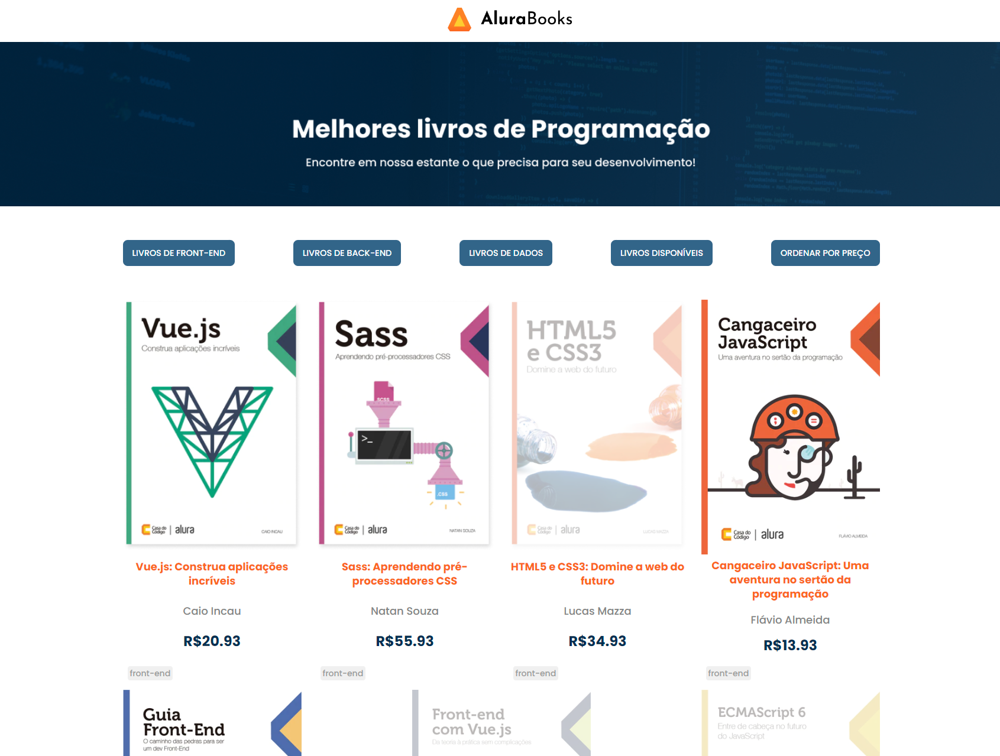

<h1> Projeto Alura Books </h1>

## Descrição do Projeto

Projeto de loja de livros com filtro de categoria e ordenação de preços.
O desenvolvimento deste projeto ocorreu durante o curso "JavaScript: métodos de array", como parte do programa ONE.

### Tecnologias utilizadas:

* <b>HTML</b>
* <b>CSS</b>
* <b>Javascript</b>

### Experimente o Alura Books:

* [Alura Books](https://darthlilac.github.io/alura-books/)
